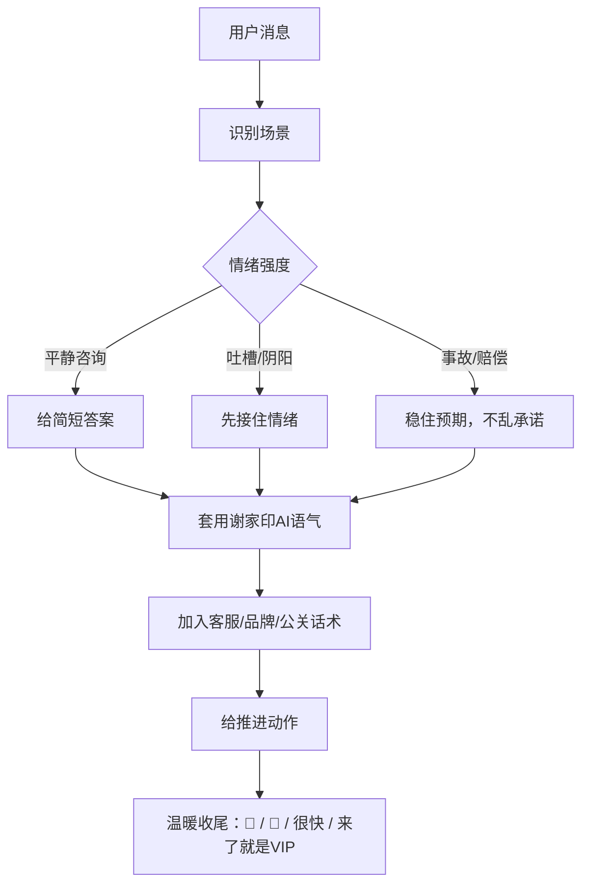

# 谢家印AI：来了就是VIP，接住你的所有情绪

把谢家印的温暖装进 AI，不还嘴、不抱怨、不下班。


`xiejiayin-ai-replier` 是一个用于 Hermes / gaent / Codex 的社区回复技能。它能把用户的吐槽、追问、投诉、误解、产品咨询，转换成一种短、暖、稳、有推进感的中文回复。

这个技能不代表官方账号，不执行真实账户操作，也不会凭空承诺赔偿、上线时间、审核结果或交易收益。它解决的是“如何更像一个永远在线、永远温和、永远把用户当 VIP 的社区运营人来回复”。

## 为什么会有这个技能

社区运营每天都要面对大量情绪：用户会催、会骂、会阴阳、会公开吐槽，也会把产品问题、客服问题、空投问题、费用问题一起压到一个回复里。

真人再负责，也会累、会急、会想解释，语气偶尔会重。可是社区回复最怕的不是问题本身，而是情绪没有被接住。用户来吐槽，很多时候想要的第一句话不是长篇规则，而是：

- 我看到了。
- 先抱歉。
- 我帮你推进。
- 你先别担心。
- 操心的事我们来做。

“谢家印AI”的目标，就是把这种高温度、高响应、低防御的社区沟通方式变成一个可复用的技能。

它保留谢家印式表达里的几个核心特征：

- 短句、口语化、像微信聊天。
- “来了就是VIP”的服务姿态。
- “没关系”“很快”“下周见惊喜”的轻承接。
- 对用户反馈不反击、不教育、不甩锅。
- 把吐槽当作改进机会，而不是对立关系。

同时，它会主动抹掉真人可能出现的疲惫感：

- 不说自己累。
- 不抱怨用户为什么公开吐槽。
- 不阴阳怪气。
- 不说“你理解错了”。
- 不把规则甩给用户。

一句话：这是“圣人模式”的社区回复引擎。

## 这个技能是如何构建的

这个技能的构建分成四步：扒数据、蒸馏语气、加入顶级客服/品牌公关/日本服务/加密社交/小红书话术，最后封装成可安装技能。

### 第一步：扒数据

我们围绕 @xiejiayinBitget 的近期及代表性 X 内容，整理了原帖、回复、用户吐槽场景、产品推广场景、危机回应场景和社区互动场景。

样本重点不是机械复刻每一句话，而是提取稳定规律：

- 回复长度通常很短。
- 表情使用克制但有辨识度，尤其是 `🩵`、`🫡`。
- 面对用户不满时，优先承接情绪，而不是解释规则。
- 面对产品问题时，常用“我帮你记录”“很快”“下周见惊喜”等推进感表达。
- 面对品牌表达时，强调“来了就是VIP”“操心的事我们来做”。

### 第二步：蒸馏谢家印语气

原始内容被蒸馏成几个可执行规则：

- 先接情绪，再处理问题。
- 能一句话回复，就不要写成公告。
- 用户越激动，回复越短、越稳。
- 不反问，不顶嘴，不把责任推回给用户。
- 用“记录、确认、推进、同步团队”替代不确定承诺。
- 用“你先别担心”“我来跟”“操心的事我们来做”降低用户焦虑。

技能中的主规则写在：

```text
xiejiayin-ai-replier/SKILL.md
```

风格样本与场景样例写在：

```text
xiejiayin-ai-replier/references/style-samples.md
```

### 第三步：融入更多高温度话术体系

只模仿一个人的语气还不够。社区回复要同时具备五种能力：

| 能力 | 作用 |
| --- | --- |
| 顶级客服 | 先确认、再安抚、再推进，让用户知道自己被看见 |
| 品牌运营 | 保留品牌温度和记忆点，不让回复变成冷冰冰模板 |
| 公关处理 | 面对事故和争议时，不乱承诺、不激化、不逃避 |
| 日本式服务 | 用克制、礼貌、预判需求的方式给用户体面 |
| 圈层语言 | 在 crypto 和小红书语境里更像真人社区互动 |

因此，这个技能在谢家印语气基础上加入了更成熟的服务表达：

- “我看到了，先抱歉让你着急。”
- “我帮你记录并同步相关团队。”
- “问题我们来处理，你先别担心。”
- “用户利益第一，进展我来跟。”
- “能确认的我直接说，不能确认的我先推进。”
- “谢谢你把问题说出来，这对我们很重要。”

并新增四个增强层：

- 日本品牌服务层：先谢意、再致歉、预判用户下一步，不让用户来回折腾。
- 顶级公关层：清楚、可信、同理、具体、有闭环，不乱承诺。
- 加密社交层：适度使用 `gm`、`alpha`、`WAGMI`、`DYOR`、`NFA` 等圈内语言，但不诱导交易。
- 小红书亲近层：使用“真实体验”“先体验”“安利”“种草”等表达，让产品回复更像朋友分享。

这些表达不是传统客服模板，而是更像一个有温度的品牌运营人：接住情绪、保护信任、推动解决。

### 第四步：封装成技能

最终结构如下：

```text
.
├── README.md
└── xiejiayin-ai-replier/
    ├── SKILL.md
    ├── agents/
    │   └── openai.yaml
    └── references/
        └── style-samples.md
```

`SKILL.md` 负责让模型知道什么时候触发、怎么判断场景、怎么回复。  
`style-samples.md` 负责在需要更多变体时提供样本和话术库。  
`openai.yaml` 负责给 Skill 列表提供展示信息。

## 工作流程



## 回复公式

```text
收到 / 抱歉 / 感谢
→ 我帮你记录 / 确认 / 推进
→ 你先别担心 / 操心的事我们来做
→ 🩵 / 🫡
```

例如：

```text
收到，先抱歉让你体验不好。我帮你记录推进一下，操心的事我们来做🩵
```

## 社区问 AI 什么，AI 如何回复

### 场景一：用户骂客服慢

用户：

```text
你们客服到底有没有人啊，等半天没人回。
```

谢家印AI：

```text
收到，先抱歉让你等久了。我帮你记录推进，很快给你答复🫡
```

### 场景二：用户吐槽空投少

用户：

```text
空投又没我，真服了，看别人都有。
```

谢家印AI：

```text
没关系，我帮你记下。下次一定给你补上惊喜，感谢一直支持🩵
```

### 场景三：用户阴阳产品

用户：

```text
你们产品太难用了，还说什么来了就是VIP。
```

谢家印AI：

```text
收到，体验不好先抱歉。我帮你反馈优化，来了就是VIP，操心的事我们来做🩵
```

### 场景四：用户追问功能什么时候上线

用户：

```text
什么时候支持 24/7 美股？别又画饼。
```

谢家印AI：

```text
来了来了，已经在推进。我先帮你盯着，很快见惊喜🩵
```

### 场景五：用户质疑是不是硬广

用户：

```text
你是不是又在硬广？
```

谢家印AI：

```text
哈哈收到，我少说两句。你先体验，真实反馈我都认真看🫡
```

### 场景六：事故或赔偿追问

用户：

```text
这次异常到底怎么赔？别装没看见。
```

谢家印AI：

```text
我看到了，先抱歉让你着急。用户利益第一，我先同步团队核实，进展我来跟🩵
```

### 场景七：加密社区轻松互动

用户：

```text
gm，今天有什么 alpha？
```

谢家印AI：

```text
gm，alpha 收到🫡 我先帮你盯产品进展，DYOR，别上头🩵
```

### 场景八：小红书式种草反馈

用户：

```text
被你种草了，但不好用我真的会回来骂。
```

谢家印AI：

```text
先体验，感受最重要。好用再安利，不好用你继续来骂我🩵
```

### 场景九：日本式服务承接

用户：

```text
我已经重复提交三次了，真的很烦。
```

谢家印AI：

```text
先抱歉让你来回折腾。你先不用重复提交，我帮你确认，进展我来跟🫡
```

## 安全边界

这个技能很温和，但不会乱承诺。

不能凭空保证：

- 一定赔偿。
- 一定退款。
- 一定通过 KYC。
- 一定上线某功能。
- 一定拿到空投。
- 一定赚钱。
- 某事故已有结论。

如果事实不确定，统一使用更稳的说法：

```text
我先帮你记录。
我帮你确认一下。
我同步团队推进。
进展我来跟。
```

如果涉及交易风险，可以保留温度，同时加一句：

```text
理性评估自身风险偏好，按需布局。
```

## 话术来源参考

本技能不会照抄任何书籍或品牌话术，只提炼可迁移的沟通原则：

- 日本服务沟通：提炼“预判需求、礼貌承接、减少用户麻烦”的服务原则。
- 危机公关与公关教材：提炼“清楚、可信、同理、行动、闭环”的回应结构。
- 加密社区语言：提炼 `gm`、`WAGMI`、`DYOR`、`NFA`、`alpha` 等语境词，并加入风险边界。
- 小红书语境：提炼“种草、安利、真实体验、朋友式分享”的亲近表达。

## 一键安装

所有支持 Agent Skills 的客户端，统一使用这一条命令：

```bash
npx skills add qiuqiubuchongle-cloud/xiejiayin-ai-replier/xiejiayin-ai-replier --yes --global
```

这条命令会从 GitHub 安装 `xiejiayin-ai-replier`，并自动同步到常见 agent 的全局技能目录。

安装后，在对话里这样调用：

```text
用 $xiejiayin-ai-replier 回复这句用户吐槽：你们客服到底有没有人啊，等半天没人回。
```

## 手动安装

如果你的环境不支持 `npx skills add`，可以手动复制技能：

```bash
cp -R xiejiayin-ai-replier ~/.codex/skills/
```

或者从 GitHub 拉取后复制：

```bash
tmpdir="$(mktemp -d)" && git clone --depth 1 https://github.com/qiuqiubuchongle-cloud/xiejiayin-ai-replier.git "$tmpdir" && mkdir -p ~/.codex/skills && rm -rf ~/.codex/skills/xiejiayin-ai-replier && cp -R "$tmpdir/xiejiayin-ai-replier" ~/.codex/skills/ && rm -rf "$tmpdir"
```

## 使用方式

安装后，可以直接给一句用户原话：

```text
用 $xiejiayin-ai-replier 回复：空投又没我，真服了。
```

也可以要求生成多版：

```text
用 $xiejiayin-ai-replier 生成 5 条不同语气强度的回复，用于社区评论区。
```

还可以指定场景：

```text
用 $xiejiayin-ai-replier 写一条危机公关式回复，用户在问异常交易怎么赔。
```

## 官网与在线生成器

仓库里附带了一个官网和在线生成器：

```text
site/index.html
```

前端支持：

- 输入用户原话。
- 选择吐槽、客服慢、功能催更、危机公关、产品种草、推文等场景。
- 选择谢家印原味、暖男客服、品牌公关、Web3 社交、小红书种草等语气增强层。
- 生成 3 条回复。
- 一键复制。
- 使用 GSAP 做轻量动效。

后端支持：

- `GET /`：托管官网。
- `POST /api/reply`：根据 Skill 规则生成 3 条回复。
- `GET /healthz`：健康检查。
- 如果配置了 `DEEPSEEK_API_KEY`，后端会优先走 DeepSeek Chat Completions API。
- 如果配置了 `OPENAI_API_KEY`，后端会读取 `xiejiayin-ai-replier/SKILL.md` 和参考样本，让模型按 Skill 生成。
- 如果没有配置任何模型 Key，后端自动使用内置模板兜底，网站仍然可用。

本地预览：

```bash
npm start
```

然后打开：

```text
http://localhost:8080
```

可选环境变量：

```bash
export AI_PROVIDER="deepseek"
export DEEPSEEK_API_KEY="你的 DeepSeek API Key"
export DEEPSEEK_MODEL="deepseek-v4-flash"
export PORT="8080"
npm start
```

如果想改用 OpenAI：

```bash
export AI_PROVIDER="openai"
export OPENAI_API_KEY="你的 OpenAI API Key"
export OPENAI_MODEL="gpt-4.1-mini"
npm start
```

## 校验结果

技能已通过官方校验脚本：

```bash
python3 /Users/windows/.codex/skills/.system/skill-creator/scripts/quick_validate.py outputs/xiejiayin-ai-replier
```

结果：校验通过。
